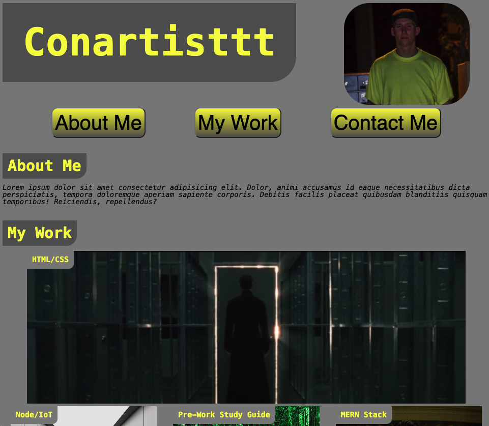
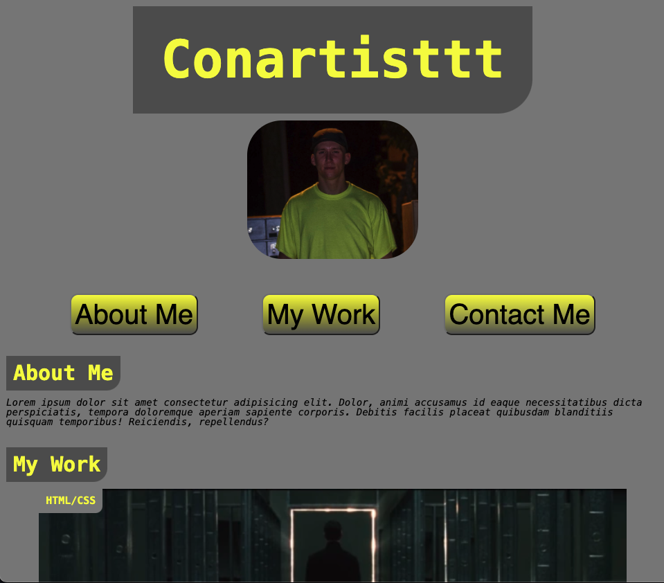
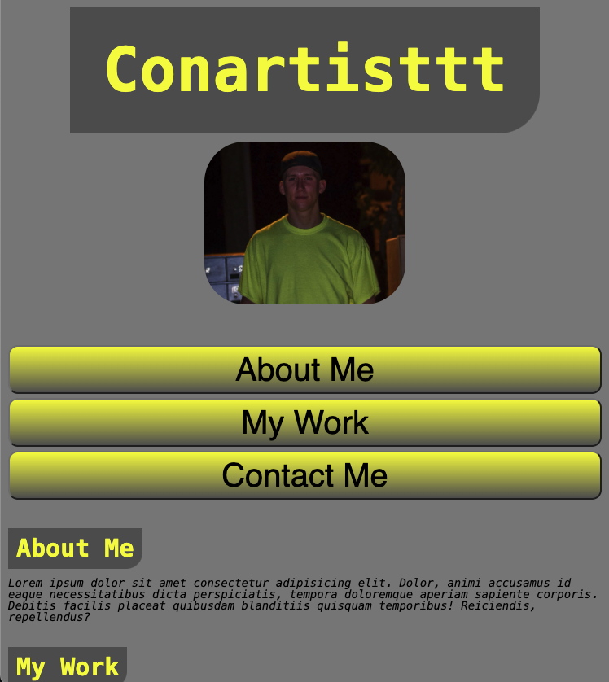
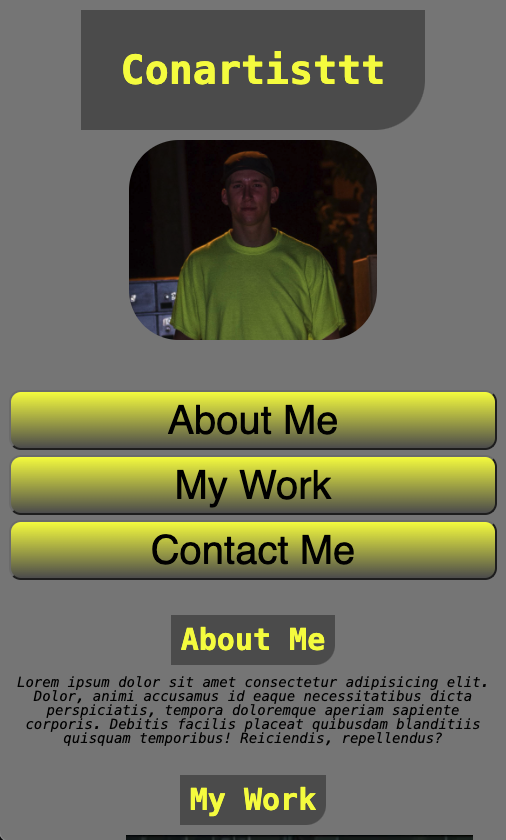

# Conartisttt-Portfolio

## Description
The purpose of this project is to showcase my skills and talents to employers looking to fill part-time or full-time positions. My goal is to highlight my strongest work, as well as the thought process behind it, so that I can show that I am a good candiate for employers. Placeholder images and names will be used at this point in time, as I do not have enough projects to showcase. As I build my expertise, I will add my developed applications to replace the placeholders.

My deployed application can be found [here](https://conartisttt.github.io/Conartisttt-Portfolio/)

## Features
* Flexbox
* Responsive Layout
* CSS Variables

The following images show the web application's appearance and functionality:
 
* Desktop
 

 
* Tablet
 

 
* Large Phone
 

 
* Small Phone
 

## Technologies Used
* HTML
* CSS

## Credits
* All code written by Conner Martin aka Conartisttt